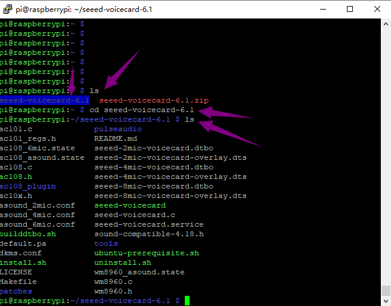
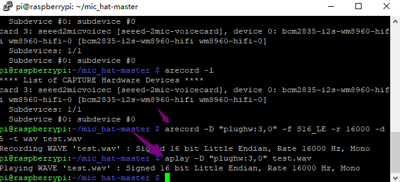

# keyestudio ReSpeaker 2-Mic Pi HAT V1.0


## Overview

This is keyestudio ReSpeaker 2-Mic Pi HAT V1.0 shield designed for AI and voice applications. It is a low power stereo Codec based on the  WM8960.
  There are two microphones on the shield for sound collection, three  APA102 RGB LEDs, one user button and two connectors for application  extension. The shield comes with a 2.54mm Grove cable  
 In addition, a 3.5mm audio jack or XH2.54-2P speaker output can be used for audio output.
 With this shield, you can build a more powerful and flexible voice  product that integrates Amazon Amazona voice services, Google Assistant, and more.
 Note:After plugging in speaker module, the status of RGB LED is not stable; however,the status is normal when testing RGB.


[


## Features

- Support the Raspberry Pi 3B,4B
- Two microphones (Mic L and Mic R)
- Two Grove connectors
- One User-defined button
- 3.5mm audio interface
- XH2.54-2P audio output interface

Note:The experiment is done with Raspberry Pi 4B. Yet other versions of Raspberry Pi may not be compatible.


## PINOUT


## Interface Explanations

1) **Button:** default connected to GPIO17

2) **Mic L and Mic R:** microphone (labeled LEFT and RIGHT)

3) **RGB LED:** three APA102 RGB LEDs, connected to the SPI interface of Raspberry Pi.

4) **WM8960:** Low Power Stereo Codec

5) **Raspberry Pi 40 pin header:** support the Raspberry Pi Zero,  Raspberry Pi 3B and Raspberry Pi 4B.

6) **POWER:** Micro USB port that powers the ReSpeaker 2-Mic Pi HAT. Power the circuit board to supply enough current when use the speaker.

7) **I2C:** Grove I2C port, connected to I2C-1

8) **GPIO12:** Grove digital port, connected to GPIO12 and GPIO13

9) **XH2.54-2P SPEAKER OUT:** connecting speakers, XH2.54-2P connector

10) **3.5mm audio jack:** connecting headphones or speakers with 3.5mm audio plug

    ## Test Method

    **1.** Firstly install the 2018-06-27-raspbian-stretch-lite to the RPI control board. You can download the image system from the link:

    https://downloads.raspberrypi.com/raspios_lite_armhf/images/raspios_lite_armhf-2022-09-07/2022-09-06-raspios-bullseye-armhf-lite.img.xz

    

    Refer to the image installation from the link:
     http://wiki.keyestudio.com/index.php/KS0221_keyestudio_Ultimate_Starter_Kit_for_Raspberry_Pi

    **2.** Log onto the image file, followed by installing the driver as below. 
     **sudo apt-get update**   

    

    **sudo apt-get upgrade**


**Enter "y" and press the "ENTER key" to continue.**


**Enter the website https://www.dropbox.com/scl/fo/4x60kwe9gpr3no0h6s2xl/AP9QcnN3ApKXkGh9CJPLDzU?rlkey=1sjn1xxr114zviozu0pguwpnd&e=1&dl=0 to download the zipped package file.**

**Then put the package downloaded into the RPI system using the \*WinSCP\*software.**


**Enter the \*unzip seeed-voicecard-6.1.zip\* to unzip the package**


**Then enter the \*cd seeed-voicecard-6.1\* into the folder**



**Enter the \*sudo ./install.sh\* to start to install the file.**


**Installation finished and reboot.**

unzip "

**unzip "mic_hat-master.zip", and refer to "seeed-voicecard-6.1.zip"**


**Go into the \*mic_hat-master\* folder, and enter \*aplay-l\*, check whether the voicecard name matches with the source code seeed-voicecard.**

**Test, you will hear what you say to the microphones(don't forget to plug in an earphone or a speaker)**

```bash
arecord -D "plughw:3,0" -f S16_LE -r 16000 -d 5 -t wav test.wav
aplay -D "plughw:3,0" test.wav
```



**Note:** "plughw:3,0" is the recording(or playback device number) , depending on your system this number may differ (for example on Raspberry Pi 0 it will be 0, since it doesn't have audio jack) We can find it via "arecord -l" and "aplay -l".

**Test the 3 LEDs on the shield.**

All the Python scripts, mentioned in the examples below can be found inside this repository. To install the necessary dependencies, from mic_hat repository folder, run

```bash
sudo apt-get install portaudio19-dev libatlas-base-dev
```


**APA102 LEDs**

Each on-board APA102 LED has an additional driver chip. The driver chip takes care of receiving the desired color via its input lines, and then holding this color until a new command is received.

```bash
python3 interfaces/pixels.py
```

<video src="./media/LED.mp4"></video>

**User Button**

There is an on-board User Button, which is connected to GPIO17. Now we will try to detect it with python and RPi.GPIO.

Execute the following code from mic_hat folder repository, which you cloned at Step 4.

```bash
python3 interfaces/button.py
```

It should display "on" when you press the button:

```bash
python3 button.py
```

Output like


